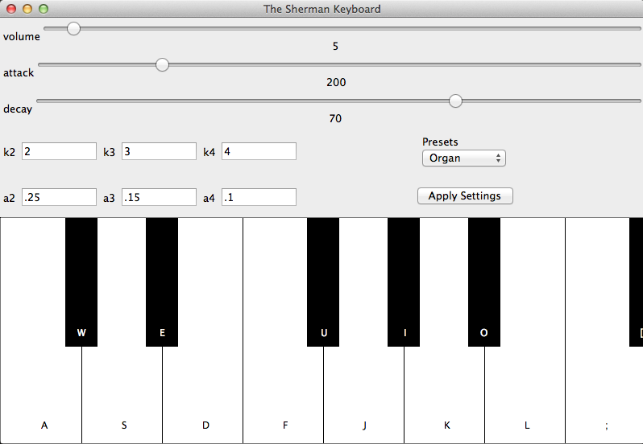

# The-Sherman-Keyboard



##Authors
Stuart Tomkins

Kevin Waco

Eamon Lightning


##Overview
The emulation of instruments via audio signal processing is a challenging task and racket provides the tools for
generating and manipulating simple sine waves through several different libraries. These libraries can be used to
create more complex sounds that emulate the characteristics of real life instruments. The Sherman Keyboard will be a
synthesizer that will give the user the ability to program their own complex sounds by adjusting different settings
built into the UI as well as the ability to use interesting pre-configured settings that sound similar to real
instruments.

##Concepts Demonstrated
Identify the OPL concepts demonstrated in your project. Be brief. A simple list and example is sufficient. 
* **Data abstraction** is used to provide access to the elements of the RSS feed.
* The objects in the OpenGL world are represented with **recursive data structures.**
* **Symbolic language processing techniques** are used in the parser.

##External Technology and Libraries
Briefly describe the existing technology you utilized, and how you used it. Provide a link to that technology(ies).

[portaudio](http://pkg-build.racket-lang.org/doc/portaudio/index.html)

[ffi/vector](http://docs.racket-lang.org/foreign/homogeneous-vectors.html)

[racket/gui](http://docs.racket-lang.org/gui/index.html?q=racket%20gui)


##Favorite Lines of Code

####Stu:
These lines of code are the event handling when the user left clicks a key. When the determine-note-on-click
procedure is called, it determines what key is pressed on the synth based on the pixel position of the mouse.
```
    (define/override (on-event event)
      (when (send event button-down? 'left)
        (determine-note-on-click event)))
```

####Kevin:

```
  (define (create-note-hash)
    (define note-hash (make-hash))
  
    (define (init freqs timbre attack max-volume num-of-harmonics)
      (if (null? freqs)
        note-hash
        (begin (hash-set! note-hash (car freqs) (create-tone (car freqs)
                                                             timbre
                                                             attack
                                                             max-volume
                                                             num-of-harmonics))
               (init (cdr freqs) timbre attack max-volume num-of-harmonics))))
        
    (lambda (cmd)
      (cond ((eq? cmd 'init) init)
            ((eq? cmd 'play) (lambda (pitch) (hash-ref note-hash pitch))))))
```

####Eamon:

```

  (define sample1 (real->s16 (* a1 a (sin (+ (* tpisr t (* fundamentalFreq k1)) phase1)))))
  (define sample2 (real->s16 (* a2 a (sin (+ (* tpisr t (* fundamentalFreq k2)) phase2)))))
  (define sample3 (real->s16 (* a3 a (sin (+ (* tpisr t (* fundamentalFreq k3)) phase3)))))
  (define sample4 (real->s16 (* a4 a (sin (+ (* tpisr t (* fundamentalFreq k4)) phase4)))))
  (s16vector-set! vec (* 4 t) sample1)
  (s16vector-set! vec (+ 1 (* 4 t)) sample2)
  (s16vector-set! vec (+ 2 (* 4 t)) sample3)
  (s16vector-set! vec (+ 3 (* 4 t)) sample4))
     
```


#How to Download and Run
You can click the link to the left to download the zipped folder containing our source code. To run the synthesizer, 
open the keyboard.rkt file in Dr. Racket, and run it.
